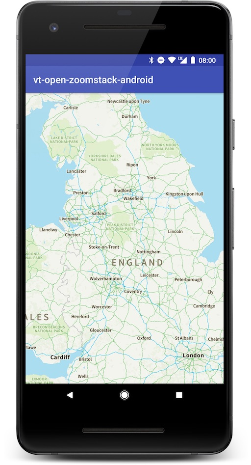

# OS Open Data Zoomstack

A simple demo to access the [OS Open Data Zoomstack](https://www.ordnancesurvey.co.uk/business-and-government/products/os-open-zoomstack.html) Outdoor style from [Mapbox GL Android](https://github.com/mapbox/mapbox-gl-native).

You can configure the map in the MainActivity, where you will see the following:

```java
    mapView.getMapAsync(mapboxMap -> {
      Resources res = getResources();
      UiSettings settings = mapboxMap.getUiSettings();
      settings.setLogoEnabled(false);
      settings.setAttributionEnabled(false);
      mapboxMap.setCameraPosition(new CameraPosition.Builder()
          .zoom(res.getInteger(R.integer.zoom))
          .bearing(res.getInteger(R.integer.bearing))
          .target(
              new LatLng(Double.valueOf(getString(R.string.lat)),
                  Double.valueOf(getString(R.string.lon)))
          )
          .build());
      mapboxMap.setStyle(new Style.Builder().fromUrl(getString(R.string.default_map_style)));
    });
```

The zoom level, bearing, and target (map focus) are configured from resource values.
See strings.xml and integers.xml for a starting point.

If you are just starting Android development we recommend that you download [Android Studio](https://developer.android.com/studio) and open this project by selecting build.gradle.


